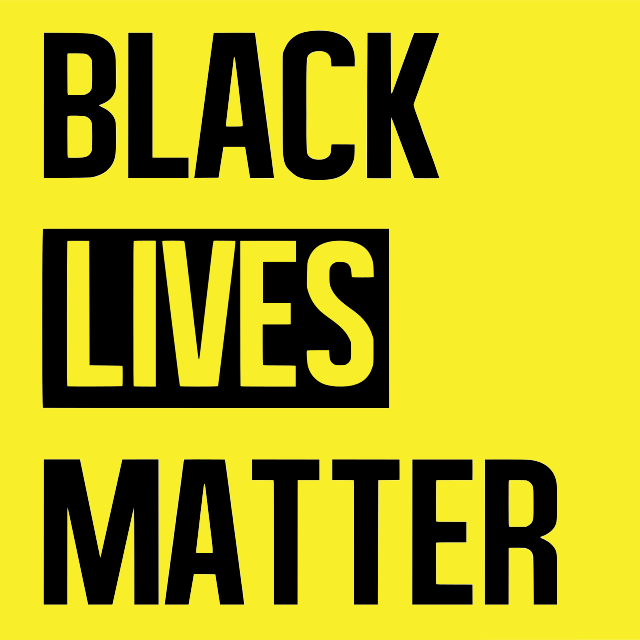

## About
My name's Ethan,I'm a maker and my medium is technology. While completing my BS in Information Science at CU Boulder, I've spent 3.5 years in industry building various data-centric skills like SQL, Python, NLP and visual sotrytelling. I spent 2.5 years in the corporate atmosphere at IBM building data pipelines, business intelligence applications and practicing participatory design. Afterwards I completed internships in the tech-health and web3 industries. I'm actively looking for the next opportunity to grow my skills building with technology.
---

## I'm still putting some projects together

  

    # Analysis and Storytelling
    

        <a href="https://basalt-streetcar-3c0.notion.site/One-page-writeup-aa8b0d8e9bf3494b9117db7b62113f8e", target="_blank">
            
            

            <h3 style="margin:0;">Hack for Racial Justice</h3>
            

        </a>
    

  

  

    # NLP and AI
    

        <a href="https://basalt-streetcar-3c0.notion.site/Company-name-generator-e1bcef8f7aa648eeb667b0b7048e412d" target="_blank">
            
            

            <h3 style="margin:0;">Convolutional RNN Text generation</h3>
            

        </a>
    

  

---
[Project 3 Title]()

---

### Category Name 2

- [Project 1 Title](http://example.com/)
- [Project 2 Title](http://example.com/)
- [Project 3 Title](http://example.com/)
- [Project 4 Title](http://example.com/)
- [Project 5 Title](http://example.com/)

---

---

Page template forked from <a href="https://github.com/evanca/quick-portfolio">evanca</a>

<!-- Remove above link if you don't want to attibute -->
